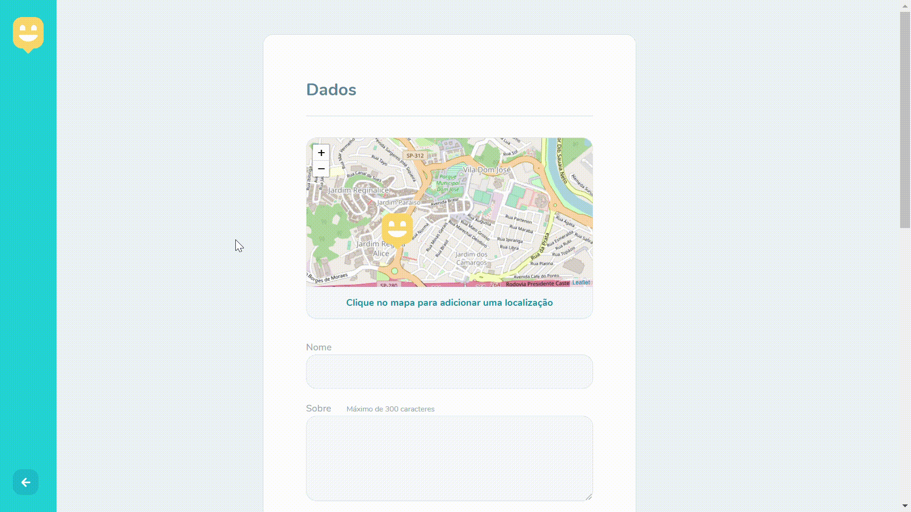

# Happy   

### Aplicação desenvolvida durante a NLW#3 oferecida pela Rocketseat  

#### Objetivo

Desenvolver uma aplicação que cadastre orfanatos de determinada região e disponibilize localização e contato com os mesmos,
levando alegria e carinho para diversas crianças.

##### Projeto desenvolvido de 12/10 até 17/10

#### Page-Landing:

#### Localize-Orphanages:

#### Page-Orphanages:

#### Page-Create-Orphanage:

### Tecnologias utilizadas

**FRONT-END**

- HTML5;

- CSS3 (FlexBox / Grid);

- JavaScript (ES20);

- Handlebar; 

**BACK-END**

- Node JS;

- Express;

- Node Packages Manager (NPM);

- Nodemon;

### Contribuição

- clone o repositório clicando <a href="https://github.com/Ivan-Vidal/Happy-NLW-3.git" style="text-decoration: none;" >aqui</a>;

- Instale as dependências utilizando o comando **npm install** em seu terminal (Certifique-se que está na pasta onde o clone do projeto está localizado);

- Dentro do terminal execute o comando **npm start**;

- Abra o seu navegador favorito e digite    **https://localhost:5500** e aproveite todas as funcionalidades;

## Obrigado pela visita !
